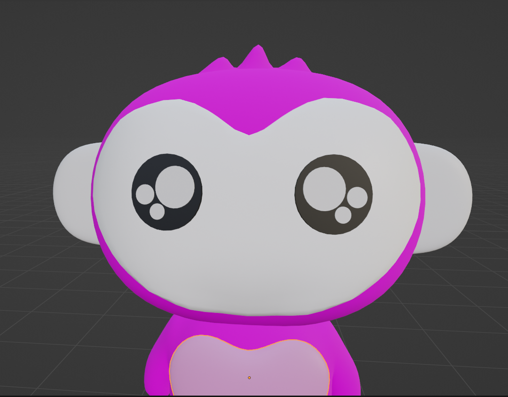

## 😆 SHEN CHENGCHENG | シン　ショウセイ | 沈 承誠
### 🕹️ 志望職種：ゲームプログラマー（職種・技術領域は柔軟に対応可）
<!-- 分栏布局 -->

  <!-- 左侧栏（70%） -->
  

---
## 📌 自己紹介
独学でプログラミングを習得。C#・Unity・C / C++ によるゲーム開発に熱中。 実用性・ユーザー志向を重視し、優れた構造とモジュール設計を追求。性能最適化にも関心があり、面白い人と面白いものを作りたい。

## 🧪 プロジェクト
### 🎮 自作 Unity3D 中規模RPG - 🐥 Duck Town
- C#のコルーチン/イベント／デリゲート/LINQ等活用
- ステートマシン・自作三人称カメラを実装  
- スキル・インタラクト・インベントリ・ショップ統合  
- オブジェクトプール・データ駆動
- イベント駆動設計・モジュールの疎結合  
- Factory／Strategy／Observer／DI設計パターン活用  
- CG最適化・デバッグツール
- Shader Graph/パーティクルシステムによる表現補強
- 🔗 [GitHub（ソースコード）](https://github.com/xxx)｜📹 [動画デモ](https://youtube.com/xxx)

### 🎮 ゲームエンジン系 C++ デモ
- C++ / SDL2：シューティングミニゲーム（基本機能実装済）  
- OpenGL：2D／3D描画デモ  
- マルチスレッド：スレッドプールの実装  
- イベントディスパッチャ（イベントスケジューラ）デモ

## 🧩 アルゴリズム・データ構造
- LeetCode：現在までに262問を実装  
- 実装重視。主要なデータ構造のAPIに把握あり  
- 計算量（Big-O）に対する感度あり  
- アルゴリズム訓練を通じて、システム思考と自信を育成
 
 

---
  

  <!-- 右侧边栏（30%） -->
  

 

**🏷️ 技術スタック**  

▼ 使用言語

  C#
  C/C++
  多线程

▼ ゲーム／グラフィックスエンジン

  Unity3D
  Unity2D
  OpenGL
  SDL2

▼ 開発ツール

  Git
  GitHub
  VSCode
  Visual Studio

▼ この履歴書について

  MarkDown
  HTML
  CSS
  Pandoc

▼ その他の知識

  Qt
  .NET Framework
  SQL/MySQL/SQLite
  Linux Ubuntu
  Raspberry Pi
  Bash
  SSH
  TCP/IP
  Vim

  

<!-- 强制分页 -->

    
  

### 📚 学歴・資格

**2010/09〜2014/06**  
寧波大学（中国「一流大学計画」対象校）  
イノベーションクラス  
会計学士   

**2016**  
思考と環境の限界を超えるため  
日本語を独学開始  

**2017/12**  
日本語能力試験 N1 合格

**2024/09〜現在**  
東京ワールド日本語学校   
ビジネスクラス 在籍

**英語関連**  
IT学習では主に英語資料を使用

---

### 🌟興味  
大泣き、大笑い  

---

### 📌基本信息  
**生年月日・性别・国籍**  
1992/05/31 女性  中国  

**連絡先**  
gougoubaobao030@gmail.com   
450777820@qq.com   
📱 070-1561-1919  

**現住所**  
東京都北区田端新町3丁目9-12コスモ田端615号  

**在留期限**  
2025年12月24日（留学ビザ）
    

  

---
### 💼 職務・プログラミング学習歴

- **2014〜2020**｜会計関連の業務経験  

- **2017**｜ネット環境問題を機に独学  
  - Linux運用の理論を一定程度理解  
  - ネット通信・プロトコルに関心  
  - 突破口を探して試行錯誤を重ねる

- **2022**｜自作ノベルゲーム「人狼」
  - Graphics View Framework 使用  
  - Signal(Slot/Emit)による処理設計  
  - ゲーム開発の純粋な喜びを実感  

- **2022**｜MushRoomゲームスタジオ
  - キャラクター管理システムの制作  
  - C#・.NET Framework・MySQL  
  - CRUD実装、MVC設計、SOLID原則
  - 良い設計と「把握感」に惹かれる
  
---

### 🌱  職業性格の原点
- 平凡な資質ながら、高校時代に数学で学年1〜2位を取り、多くの応用問題を解き、恩師に応えた
- 基礎を極めれば、深い理解と独自の発想に至れると信じている
### 🧠 プログラミング観・職業観
- プログラミングは修行のような営み。楽ではないが、そこにこそ自由がある。
- 仕事は幼少期からの信条。かつては「好きなことをする」、今は「する中で好きになる」  
### 🌸 来日動機
- 幼少期 ＝ ファミコン
- 職人文化に惹かれ、視野を広げたいと来日
- Tokyo Indies などを通じ、実力ある開発者に直接学べる環境に魅力

 

---
  

